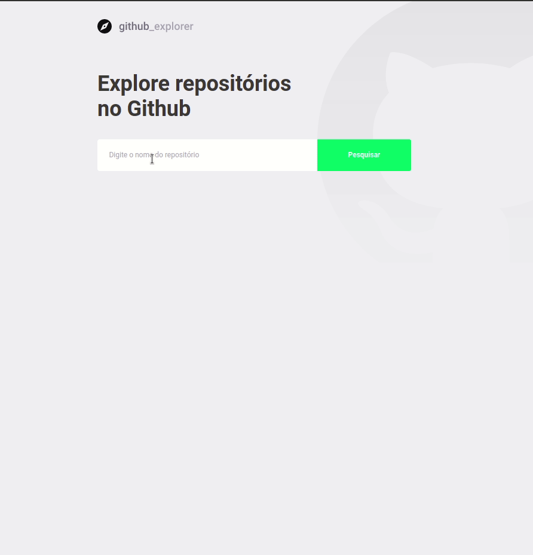

<h1 align="center">
  
</h1>

<h1 align="center">
  
</h1>

# Indice

- [Sobre](#-sobre)
- [Tecnologias utilizadas](#-tecnologias-utilizadas)
- [Como baixar o projeto](#-como-baixar-o-projeto)

## 📄️ Sobre

Projeto desenvolvido durante o Bootcamp GoStack. Este projeto realiza o consumo da API do github, permitindo pesquisar repositórios de algum usuário e visualizar informações como número de forks, stars e visualizar as issues em aberto.

---

## 🤖️ Tecnologias utilizadas

O projeto foi desenvolvido utilizando as seguintes tecnologias:

- [ReactJS](https://reactjs.org)
- [TypeScript](https://www.typescriptlang.org/docs/home)

---

## 📦️ Como baixar o projeto
```bash

  # Clonar o repositório
  $ git clone https://github.com/thiagoasb/github_explorer

  # Entrar no diretório
  $ cd github_explorer

  # Instalar as dependências
  $ yarn install

  # Iniciar o projeto
  $ yarn start
```
